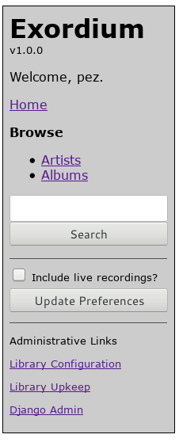
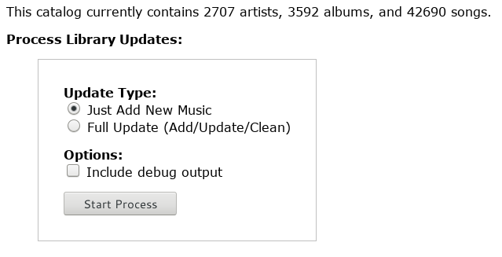

.. Administration

Administration
==============

When logged in to Django as a staff member, the lefthand sidebar will
include three links at the bottom, for Django administration:

    Administrative Sidebar

Library Configuration
---------------------

**Library Configuration** links to a Django administrative backend
page provided by ``django-dynamic-preferences``, which provides
access to the only real configuration options available in Exordium.
There are four variables which can be configured:

Exordium Library Base Path
    This is the directory on the server where Exordium can find all
    your music files.  There can be various mounts underneath this
    directory (network or otherwise), but all music files must be
    underneath here somewhere.  Note that even though Exordium will
    never attempt to do any write operations on the library, it's
    best if the user running Django does not have write access into
    this directory, anyway.

Exordium Media URL
    This is the URL which provides direct web access to the files
    contained in the library base path, above.  This will most
    likely be a static directory configured in Apache or whatever
    other frontend web server is in use.  Technically this option
    does not have to be specified for Exordium to work, but track
    downloading and music streaming won't work unless it is.

Exordium Zip File Generation Path
    For full-album downloads, Exordium will create a zipfile on
    the filesystem and then give the user a link to that zipfile.
    This option specifies the directory in which the zipfile will
    be written.  This is the only location on the filesystem where
    Exordium requires any write access.  If this option is not
    specified, the button for album zipfile downloads will be
    hidden.

Exordium Zip File Retrieval URL
    Similar to "Exordium Media URL" above, this is the URL to the
    zipfile generation path, typically configured via Apache or
    whatever the frontend webserver is.  Without this option,
    the button for album zipfile downloads will be hidden.

Library Upkeep
--------------

**Library Upkeep** is where music will be added to the library, and
changes/deletions will be processed.  Clicking on the link will bring
up the following, in addition to showing the library configuration
values configured in **Library Configuration**:

    Library Management

Most of the time you will just be interested in adding new music to
the database, so keeping the defaults and hitting "Start Process"
is all you need. If there have been changes to existing files on
disk (or if files have been deleted, etc), then you can use the
"Full Update" option to do a full comparison of the database to
the on-disk state.  In practice there isn't much difference between
the two options, speedwise, even though the update option technically
does more work.  The "Full Update" will also re-scan for album art,
for albums which do not have album art already.

The checkbox to "Include debug output" can be used to include more
information about the update process as it proceeds, though in general
there isn't a need to do so.  If you encounter problems during the
update, it would probably be nice to have that option turned on while
investigating/reporting the bug.

Note that the initial load of a largeish music library into Exordium
can take quite awhile.  On my system, a library of 42,000 tracks takes
about an hour to do the initial add, the majority of that time spent
looping through the filesystem computing checksums of all the tracks.
Exordium uses SHA256 for its checksums, and while SHA1 or MD5 are
faster, and would probably be sufficient for our use, on my system
this process is primarily I/O bound, and using the faster algorithms
don't actually provide any significant speed increase.

Django Admin
------------

This is just a convenience link to the main Django administration
area.  In general, there is unlikely to be much need to edit Exordium
objects from inside the administration area, but it might be useful in
some circumstances to tweak values manually in there.
