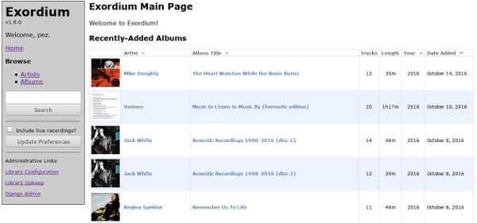

.. Exordium documentation master file, created by
   sphinx-quickstart on Tue Oct 18 10:07:38 2016.
   You can adapt this file completely to your liking, but it should at least
   contain the root `toctree` directive.

.. toctree::
   :maxdepth: 2
   :hidden:

   self
   assumptions_limitations
   requirements
   installation
   administration
   screenshots
   wsgi_deployments
   migration
   apache_deployment_howto
   changelog
   todo

Exordium Music Library
======================

Introduction
------------

Exordium is a read-only web-based music library system for Django.
Exordium will read mp3, ogg, and m4a files from the host filesystem and provide
an online interface to browse, download (as zipfiles or otherwise), and
stream.

The HTML5 media player `jPlayer <http://jplayer.org/>`_ is used to provide
arbitrary streaming of music.

    Exordium Main Screen

Exordium was built with a very specific set of operational goals and does
not attempt to be a generic library suitable for widespread use.  There are,
in fact, no configuration options beyond those to define the file paths/URLs
necessary for basic usage.  Patches to add/change functionality will be
happily received so long as they don't interfere with or disable the current
functionality by default, but there is no internal development goal to make
Exordium a generic solution.

Download
--------

Exordium is available to install on PyPI via ``pip install django-exordium``.
PyPI also hosts Python packages for Exordium in both source and
`Wheel <https://pypi.python.org/pypi/wheel>`_ formats, at 
https://pypi.python.org/pypi/django-exordium/.  Source and Wheel downloads
of all released versions can also be found at Exordium's hompeage at
http://apocalyptech.com/exordium/.

Exordium sourcecode is hosted at `GitHub <https://github.com/apocalyptech/exordium/>`_,
and sourcecode archives of released versions can be found there at
https://github.com/apocalyptech/exordium/releases

Documentation is included in the project's ``docs/`` directory, but
is also uploaded to:

- http://apocalyptech.com/exordium/
- http://exordium.readthedocs.io/

Detailed Documentation
----------------------

:doc:`assumptions_limitations` provides information about
how Exordium does things, and would be a good place to determine if
Exordium is a good operational fit for the kind of web library
app you're looking for.

:doc:`screenshots` contains screenshots of all of Exordium's main
pages, and is probably the best place to look to get a feel for how
Exordium operates from a user perspective.

See :doc:`requirements` for Exordium's requirements, :doc:`installation`
for installation instructions onto an existing Django project, and
:doc:`administration` for information on administration and library
upkeep.

If deploying via Apache, :doc:`wsgi_deployments` contains some information
that might be useful.  :doc:`apache_deployment_howto` is a complete guide to
how Django is deployed for my own use.

:doc:`changelog` and :doc:`todo` contain some information about version
history and future plans.

Other Information
-----------------

The name "Exordium" comes from the fictional technology of the same name in
Alastair Reynolds' "Revelation Space" novels.  It's not a perfect name for
the app, given that the Revelation Space *Exordium* would make a pretty
lousy music library, but at least there's some element of data storage and
retrieval.  Exordium the *web-based music library*, as opposed to its
fictional counterpart, is only capable of retrieving music which has been
imported to it in the past.  I'll be sure to contact all the major news
organizations if I figure out a way to get it to retrieve music stored in the
future.

.. Indices and tables
.. ==================
.. 
.. * :ref:`genindex`
.. * :ref:`modindex`
.. * :ref:`search`

