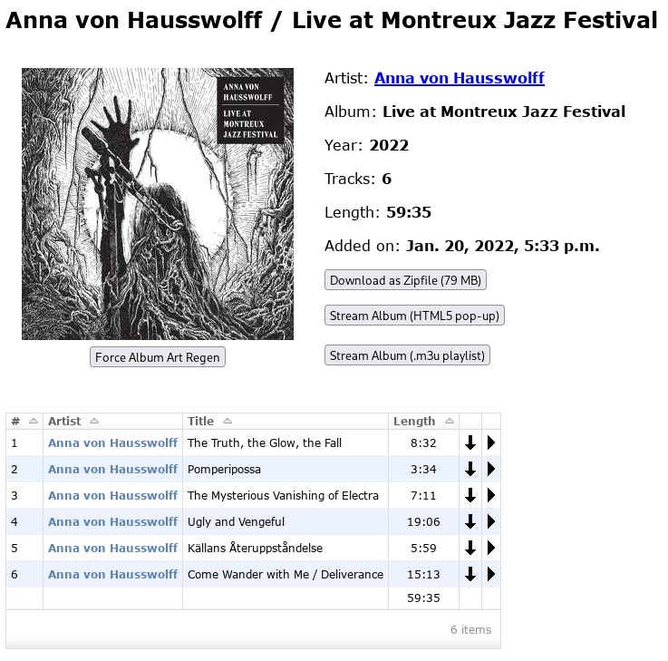
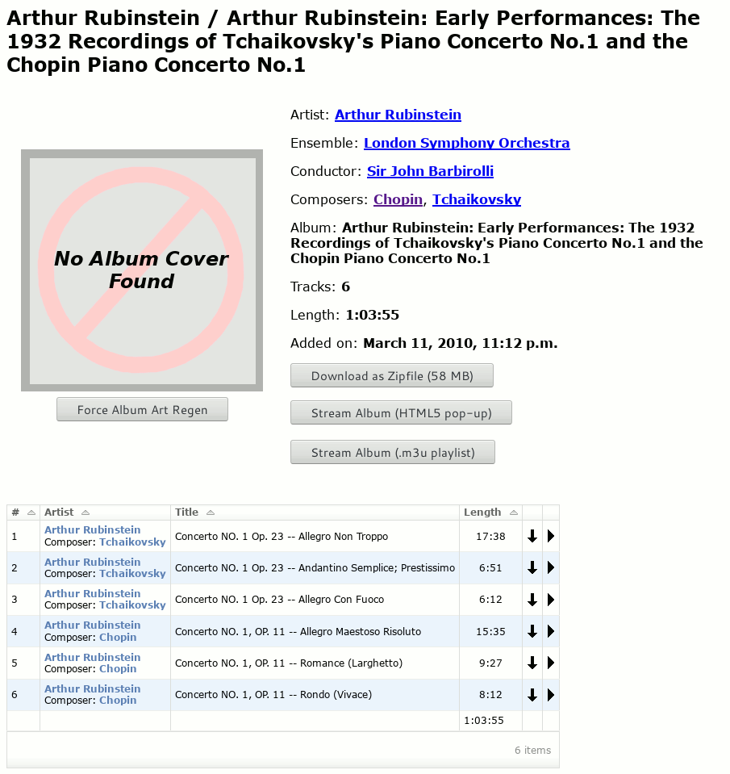
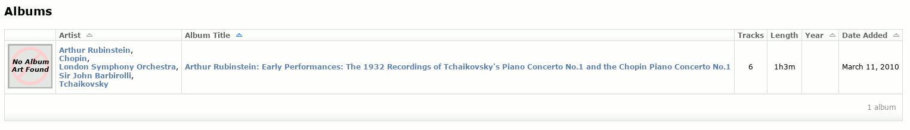
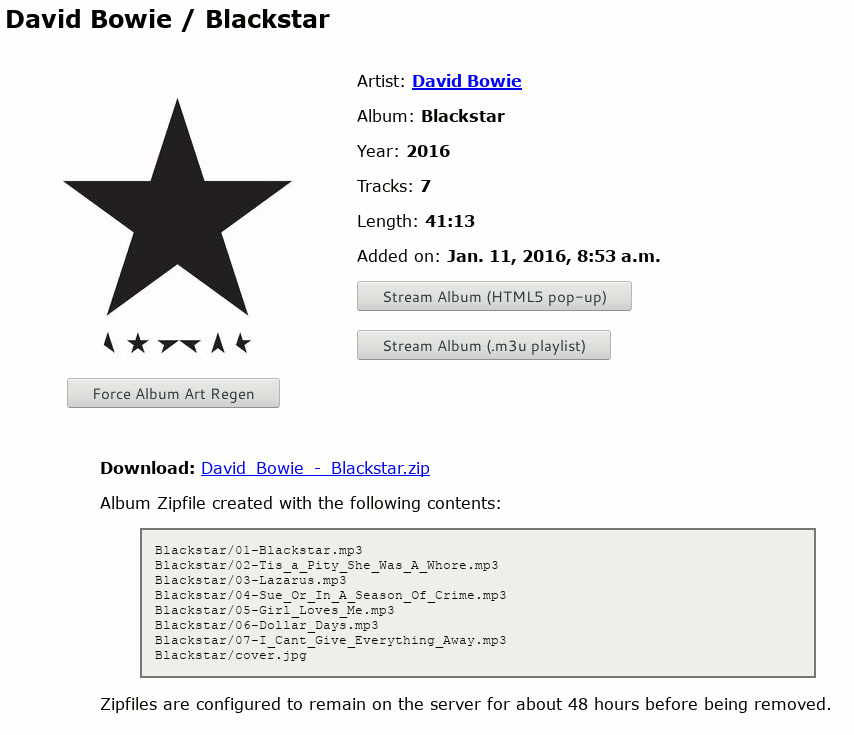

.. Screenshots

Screenshots
===========

This page contains various screenshots showing off Exordium's functionalty
from a user's perspective.

Main Page
---------

.. figure:: images/main.png
    :align: center
    :scale: 50%
    :alt: Exordium Main Screen

    Exordium Main Screen, showing recently-added albums.

All lists of albums will show the number of tracks, total album length, the
released year of the album, and the date added to the library.  The sidebar
will be present on all pages.  The "administrative links" at the bottom of the
sidebar will only be shown to logged-in users who are set to staff.

The sidebar contains a textbox to search through the library, and
a checkbox to either include or exclude live recordings while
browsing the library.  Live recordings are albums whose title is
of the format "*YYYY.MM.DD - Live**".  Logged-in users will have
their live-album preference saved between sessions.

Browsing Artists
----------------

    Browsing artists.

This view will show the number of albums and
number of tracks.  Clicking on an artist name will bring up a list
of albums and songs by that artist.

Artist Listing
--------------

    Browsing all albums/songs by an artist.

Tracks by an artist which don't have an Album tag will get sorted into
a special "Non-Album Tracks" album, as can be seen here.  After all the
albums explicitly belonging to the artist have been shown, any "Various
Artists" album they appear in will be listed.  In this case, Plaid can
be found on two compilation albums.

Below the album list will be a song list.  Each song will have two icons
on the right-hand side of the table.  The first, the arrow pointing down,
provides a direct link to the track.  The second will open up a popup window
with the HTML5 media player jPlayer, which will then stream the track.
Clicking on more than one track will add the track to jPlayer's playlist.

Artists with more than 500 songs will not have their song lists shown here,
for performance reasons.

Browsing Albums
---------------

    Browsing albums.

The "Browse Albums" view will sort by Album Title by default.

Album View
----------

    Album View

After clicking on an album link, a full page will be shown containing all the
album details.  If zipfile downloading is configured, a "Download as Zipfile"
button will be shown at the top.  The two streaming buttons will be shown
in any case - the first will open the HTML5 media player jPlayer in a popup
window, and the second will generate an ``.m3u`` playlist which other media
player applications should be able to use.  The "Force Album Art Regen"
button will only be visible to logged-in staff members, and will tell Exordium
to look for new/updated album art in the album's directory.

A list of all tracks in the album is shown after the summary information.
Like in the Artist view above, each track will have a download and stream
button.

Classical Tags
--------------

    Classical Tags

Exordium supports tags for Ensemble/Group, Conductor, and Composer. These are
most commonly seen with classical music, though of course they can be used
on any track.  Any tags common to all tracks in the album will only be reported
up at the top section of the album view screen.  Those which may differ from
track-to-track will be inserted into the Artist column in the song list, as seen
above.

These extra tags will also be shown in album lists where appropriate.  For
instance, the above album will look like the following in an album list:

    Album List with Classical Tags

Album Zipfile Downloads
-----------------------

    Album Zipfile Downloads

Clicking the "Download as Zipfile" button will result in a page showing you
the exact zipfile contents, and a link directly to the zipfile (using your
configured Zipfile URL as a prefix).  If the download link is clicked again
while the zipfile is still present, Exordium will just provide a URL to
the existing file, rather than regenerate.

Searching
---------

    Search Results

The search box will match on artist names, album names, and song titles, and will
show all relevant hits of each type.  The screenshot above matched on an album
name and a bunch of track names.

Live Albums
-----------

Exordium has the ability to hide or show "live" albums as-requested.  If
Exordium sees an album whose name looks like "YYYY.MM.DD - Live*", it will
consider it a "live" album and hide it by default.  This was put into place
because I have many live recordings in my library and they often overwhelm
the list of albums that I'm more commonly interested in, otherwise.  Here
is a search for the band "23 Skidoo" without, and then with live albums turned
on:

    Live albums turned off (the default)

    Live albums turned on

Streaming
---------

    Streaming an album

The HTML5 media player jPlayer is used to handle in-browser streaming,
via a popup.  It's not fancy, but it gets the job done.  It turns out
that this player will even work on Android phones (and possibly iPhone,
though I don't have one of those to test).

Administration
--------------

Screenshots of the administration sections can be found in :doc:`administration`.
